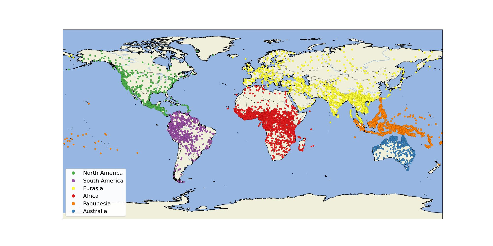

# Create Map of the Languages by Macro-Area

To create the map, you must have installed the [cartopy package](https://pypi.org/project/cartopy), which may require the installation of additional packages. You can install the packages required with `pip`.

```shell
$ pip install -r requirements.txt
```

Running the script [`base-map.py`](base-map.py) will then create the map in PDF and in JPG format.

```shell
$ python base-map.py
```




